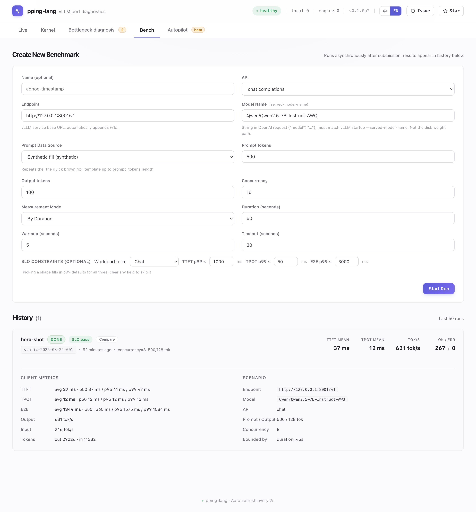

> [简体中文](README.md) | **English**

<div align="center">

# pping-lang

**A vLLM performance diagnosis plugin — always-on kernel-level observability, real-time metrics, sandboxed auto-tuning**

[](https://pypi.org/project/pping-lang/)
[](https://pypi.org/project/pping-lang/)
[](LICENSE)
[](#project-status)
[](tests/)
[](https://leon-hf.github.io/pping-lang/)

**[🌐 Live Demo →](https://leon-hf.github.io/pping-lang/)** — see the dashboard captured from a live GPU box right in your browser (Live / Kernel / Rules / Bench / Autopilot, bilingual)

[](https://leon-hf.github.io/pping-lang/)

> 🔬 **The core capability is kernel-level observability**: the depth you'd normally open Nsight Compute for — per-kernel time share, warp stall attribution, Python source lines / SASS hotspots, launch configs, per-kernel roofline — made **always-on, low-overhead, with no service stop**, and a conclusion attached. See [Kernel Observability](#kernel-observability).

> 🤖 **Autopilot runs a real closed loop on hardware**: in a sandbox it iterates *diagnose → change one knob → benchmark → keep/revert*, stepping `max_num_seqs` from 4 to 64 for **986 → 6,094 tok/s (×6.18)** — and it reverts when the SLA breaks instead of claiming victory. See [Autopilot](#autopilot).

[Live Demo](https://leon-hf.github.io/pping-lang/) · [Quick Start](#quick-start) · [Kernel Observability](#kernel-observability) · [Autopilot](#autopilot) · [Dashboard](#dashboard) · [Compatibility](#compatibility) · [Architecture](#architecture) · [Roadmap](#roadmap)

</div>

---

## Overview

vLLM itself exposes rich runtime metrics — per-request queueing and latency, how many sequences each step schedules, KV-cache and GPU-memory usage, prefix-cache hit rate, and more — and the usual way to consume them is Prometheus scraping + Grafana visualization. That approach draws curves but never states conclusions, which leaves two concrete problems:

1. **Metrics are easy to misread.** The classic case is GPU utilization: it tells you whether the GPU has work to run, not how many tokens it produces. During decode it often sits steady at 70–90% and looks perfectly healthy, while true compute utilization (MFU) is below 5% — the real bottleneck is memory bandwidth; the GPU spends most of its time waiting for data, not computing. Reading the utilization number alone, you'd never spot it
2. **Conclusions are DIY.** Which thresholds to set, which alerts to fire, which knob matches which symptom — the tool hands you raw metrics and leaves the rules and root-cause mapping entirely to you

Neither problem is solved by the usual tools:

| | Prometheus + Grafana | Nsight Compute / torch profiler | pping-lang |
|:--|:--|:--|:--|
| Setup | deploy scraping + dashboard stack | launch a dedicated profile session | `pip install`, then your normal `vllm serve`; always-on |
| vLLM semantic metrics (TTFT / TPOT / KV cache / …) | partial | — | full set |
| Kernel-level evidence | ✗ | ✓ (manual session) | ✓ always-on, incl. source-line attribution |
| Automatic verdict & prescription | ✗ (write your own rules) | ✗ (raw data only) | ✓ fact-rule engine, hot-reloadable thresholds |

pping-lang consumes the `stat_logger_plugins` callback directly, combines it with NVML physical-layer sampling, and emits structured diagnoses and optimization paths through a rule engine. Example output:

```text
[pping-lang] WARNING  GPU 利用率偏低
  GPU 平均利用率 3% 持续低于 50% 已 30s
  建议：检查 batch 是否退化为 1，或开启连续 batching

[pping-lang] WARNING  batch 退化
  并发请求数 1.0 ≤ 1.0 已 30s
  建议：增加客户端并发，或检查上游路由是否串行化
```

The Roofline view comes with an automatic verdict:

```text
当前结论  Memory-bound（decode 阶段的典型状态）
  算力利用    1%   （0.40 / 33 TFLOPS）
  带宽利用   52%   （132 / 256 GB/s）

优化路径
  · 增大 batch 直至 KV cache 占用接近 80%
  · 启用 speculative decoding
  · 权重量化 (AWQ / GPTQ)
  · 升级带宽更高的 GPU
```

Those are model-level conclusions. The deeper evidence is at the kernel level — the hardest part of pping-lang.

---

## Kernel Observability

> Nsight is the lab microscope — pulled out occasionally, read offline, raw evidence. pping-lang is the always-on stethoscope — it runs continuously, speaks plainly, and tells you which knob to turn.

Kernel-grade depth, normally reserved for Nsight Compute, made **always-on, low-overhead, with no service stop**, and conclusions attached. Enabled by default with `pping-vllm` full integration; works on the **default multi-process `vllm serve`** (PC sampling is driven inside the EngineCore process; results flow back to the dashboard across processes); both eager and cudagraph (the production default) are supported:

| Capability | What you see | Method |
|:--|:--|:--|
| Per-kernel time share + operator class | how much GPU time goes to GEMM / attention / elementwise / comm, and who the hotspots are | always-on PC sampling (fixed-period; samples ∝ GPU time) |
| Deep Evidence, "why is it slow" | warp-cycle tri-state (issued / stalled / scheduler slack), global stall breakdown, drill-down to raw PerfWorks reasons | same |
| Source-level hotspots (dual-track) | Triton kernels resolved to the Python source line + the code text; closed-source libraries get SASS instruction hotspots + kernel-name decoding (`cutlass wmma_bf16 16x16` → tile / dtype / target arch) | source lines need lineinfo (Triton / self-compiled); closed-source takes the SASS track |
| Launch origin | even a closed-source GEMM is attributed to the host code that launched it (e.g. `nn.Linear`) | DRIVER_API launch callback, backtrace on first sight |
| Launch configs | grid / block / registers / shared memory per kernel | always-on launch-hook, measured to coexist with PCS; per-launch overhead nanoseconds |
| Deep Profile | theoretical occupancy + limiter badge (registers / smem / grid) + wave quantization + concrete advice (`__launch_bounds__` / shrink tile / round grid to SM count) | pure computation (launch configs + device attributes); pause_ms=0, no service stop |
| Per-kernel roofline | per family (marlin / cutlass / gemv / flash): arithmetic intensity, achieved bandwidth, verdict — compute-bound / memory-bound / **memory-latency-bound (raise concurrency, don't touch the kernel)** | software estimate, occupies no counters; AI / verdict high-confidence, achieved low-confidence and labeled |
| L2 / DRAM measured | per-family L2 hit rate and DRAM GB/s († badge) | offline ncu calibration (once per model × GPU, ~20 min maintenance window) → online lookup |
| Snapshot A/B | "before / after" per-kernel diff of stall mix and rates, with load-drift detection — warns when the load changed, so your change isn't blamed | client-side localStorage |
| Comm breakdown | separate shares for allreduce / all_gather / reduce_scatter (multi-GPU; auto-hidden on single GPU) | same PCS |

**Why this works without stopping the service**: on a single GPU, all hardware-counter paths are mutually exclusive — a measured conclusion, not an assumption: enabling Activity records while PCS is live returns `CUPTI_ERROR_NOT_COMPATIBLE`; a sidecar process probing PM Sampling counters gets `HARDWARE_BUSY` outright. Kernel observability is therefore split into three routes: **always-on PC sampling** (diagnostic evidence) + a **launch-hook** (measured to coexist with PCS; captures launch configs) + **software estimation / offline calibration lookup** (roofline and L2 / DRAM; occupies no counters). A "true-value" deep window (stop PCS → Profiling API → restart) remains an explicit, separate decision and is off by default.

**Honest boundaries**: PCS numbers are statistical estimates, not exact microseconds; theoretical occupancy and achieved bandwidth are estimates, labeled per-item in the UI (estimate vs measured †, confidence high / low); under CUDA-graph steady state, launch configs reflect capture-time values. Requires Linux, unlocked performance counters, and a locally compilable `.so` (no g++ / CUPTI headers → automatic fallback to basic integration; no failure mode ever affects vLLM itself).

---

## Quick Start

### Offline demo (no GPU / vLLM required)

```bash
pip install pping-lang
python -m examples.embedded.demo
```

The script injects synthetic metrics; after about 7 seconds the terminal prints diagnoses, and the dashboard is reachable at `http://localhost:8765`.

### Integrating with vLLM

**Basic integration** — KPI / Roofline / NVML / diagnosis, loaded automatically, no parameter changes:

```bash
pip install pping-lang
vllm serve <model>
```

The vLLM startup log will print the dashboard address `[pping-lang] dashboard → http://localhost:8765`.

**Full integration** — additionally enable kernel-level PC Sampling (Deep Evidence, "why is it slow"):

```bash
pip install pping-lang
pping-vllm serve <model>      # 等价于 vllm serve,额外开启 Kernel 级采集
```

`pping-vllm` is a thin wrapper: on first run it **compiles on-the-fly**, on the local machine, the bundled CUPTI injection library (`libppingcupti.so`) (auto-detecting cu12/cu13 and caching to `~/.pping-lang/`), sets the injection and sampling environment variables, then `exec vllm serve` (passing all arguments through). If the `.so` cannot be built (no g++ / no CUPTI), it **automatically falls back** to basic integration.

> Kernel-level collection drives PC sampling in the **EngineCore process** via the `vllm.general_plugins` entry point, and the results flow back across processes to the frontend dashboard — it works on the **default multi-process `vllm serve`**, no single-process setup required.

---

## Autopilot

Beyond diagnosis, it auto-tunes in a sandbox: iterate *diagnose → change one knob → benchmark → keep/revert*, with **production promotion always manual**. Three convergence shapes, all validated on real hardware (runw, RTX 5060 Ti, vLLM 0.21, Qwen2.5-0.5B):

- **×6.18 on real hardware**: acting on the "admission gate too low" diagnosis, the agent stepped `max_num_seqs` from 4 to 64, keeping each round only after the benchmark verified it — output throughput 986 → 6,094 tok/s (×6.18), ending with a `vllm serve` recommendation for manual promotion
- **Willing to revert**: in another session (2026-07-07) it jumped `max_num_seqs` 4 → 32 in one move for ×5.1, but the measured TPOT p99 of 82 ms broke the 50 ms SLA — ruled a loss and reverted, converging to the honest optimum under that SLA. Proposals can be bold; the verdict only trusts data
- **Honest about walls**: on 7B-AWQ, after the diagnosis hit a bandwidth wall, the agent argued "no applicable knob" and converged without fabricating gains

See the [Autopilot quickstart](docs/autopilot-quickstart.md) to run it yourself.

---

## Dashboard

A single-page application, a single HTML file, with no frontend build tooling required. Four tabs:

| Tab | Contents |
|:--|:--|
| Live | 12 KPIs (TTFT / TPOT / throughput / KV cache / queue status / MFU / GPU utilization / VRAM / Prefix cache / Padding / preemption rate); Roofline scatter + automatic verdict; TTFT / TPOT / E2E time series. Each KPI supports hover to see the formula and interpretation |
| Kernel | Nsight-grade depth, always-on, no service stop — time share / stall attribution / source-level hotspots / launch configs / Deep Profile / snapshot compare; see [Kernel Observability](#kernel-observability). Requires `pping-vllm` full integration; both eager and cudagraph (the production default) are supported |
| Rules | Read-only view of the fact rules in effect (fact name / severity / decision condition + the threshold after config resolution / preconditions and regime gates); a centralized SLA + threshold editor where saving hot-reloads into the running engine without restarting vLLM; custom rules can be added and removed, evaluated by the same engine as the curated rules |
| Bench | A built-in OpenAI-protocol static load tester; configure endpoint / call name / concurrency / duration / prompt source, and it outputs client-side TTFT / TPOT / E2E distributions and SLO validation |

Live data is read directly from the Sink's in-memory ring buffer, with latency roughly equal to the polling interval.

---

## Compatibility

### vLLM versions

| vLLM | Status | SchedulerStats | IterationStats | cudagraph_stats | perf_stats |
|:--|:--|:--:|:--:|:--:|:--:|
| 0.20+ | Recommended | ✓ | ✓ | ✓ | ✓ |
| 0.13.x | Supported | ✓ | ✓ | ✓ (different fields) | ✗ |
| < 0.13 | Unsupported | — | — | — | — |

`perf_stats` is the data source for MFU, VRAM bandwidth utilization, and the measured Roofline, and is provided only by 0.20+. On 0.13.x:

- The MFU and padding-ratio KPIs are shown as empty (no unreliable construction is attempted)
- Roofline automatically switches to analytical mode, with an error of about ±20% in absolute values; the card indicates the data source
- All other functionality is unaffected: full TTFT / TPOT / E2E distributions, KV cache, prefix cache hits, preemption, the full set of NVML sampling, and rule diagnosis

### Runtime environment

- Linux: natively supported
- Windows: requires WSL2 + Ubuntu. When accessing the dashboard across subsystems, set `PPING_LANG_API_HOST=0.0.0.0`

### Recognized GPU list

NVML device name → BF16 peak (TFLOPs/s) and memory bandwidth (GB/s). An unrecognized GPU does not affect metric collection; only the peak-dependent derived quantities are skipped.

```
Blackwell        B200 (2250 / 8000) · B100 (1800 / 8000)
Hopper           H200 (989 / 4800) · H100 SXM/PCIe/NVL · A100 SXM/PCIe
Ada Data Center  L40S · L40 · L4
Ada Desktop / Mobile   RTX 4090 / 4080 / 4070 Ti / 4070 / 4060 Ti / 4060 (incl. Laptop GPU)
Older generations      A30 · A10G · A10 · V100 · T4 · RTX 3090
```

To add a device: add an entry to `_GPU_PEAK_TABLE` in [`src/pping_lang/hardware.py`](src/pping_lang/hardware.py).

---

## Performance

### Hot-path overhead

| Item | Measured |
|:--|:--|
| `push_metric()` per call | <5 μs |
| `record()` per call (incl. collector parsing) | ≈100 μs |
| Sink bg flush thread CPU | <1% |
| Resident memory | ≈6 MB |

### Benchmark: Qwen2.5-0.5B-Instruct / RTX 4070 Laptop / WSL2 / vLLM 0.13.0

bench concurrency=3, duration 20s:

| Metric | Value | Data source |
|:--|:--|:--|
| TTFT p99 | 305 ms | client-side |
| TPOT p99 | 22 ms | client-side |
| Output throughput | 28 tok/s | `vllm.iter.gen_tokens` |
| Per-request decode speed | 138 tok/s | 1000 / TPOT p50 |
| Compute utilization | 1.2% | analytical Roofline |
| Bandwidth utilization | 51.5% (132 / 256 GB/s) | analytical Roofline |
| Bound determination | memory-bound | median AI = 3.0 < knee 130 |

### Real-time latency

Live panel data is read directly from the Sink's in-memory layer, bypassing the persistence layer (JSONL). The end-to-end latency from a metric being produced by `record()` to being rendered in the dashboard is roughly equal to the HTTP polling period (default 2s).

---

## Architecture

```
                ┌─── live 内存层（O(1) 写 / O(1) 读）
                │       ↑                ↑
record() ──push─┤   /api/kpis        /api/metrics/recent  ≤60s
NVML 100ms ─────┤   /api/snapshot    /api/roofline        ≤60s
                │   /api/latency_trends                   ≤900s
                │
                │   Sink._latest:  name → (value, ts_ns)
                │   Sink._recent:  name → 2000-deep ring
                │
                └─── bg flush ─── JSONL append-log ─── archival 扫描
                                   metrics / diagnoses    (长时间窗，JsonlStore)
```

The hot path only performs an O(1) enqueue — no I/O, serialization, or lock waiting. Persistence is sequential append-only JSONL (no query engine / transactions / indexes, with near-zero write contention); long-window history scans files on demand and is a cold path. The diagnosis engine and the Sink flush run in their own daemon threads. The design premise: any exception in the plugin must never affect the vLLM inference path.

### Key source files

- [`src/pping_lang/sink/base.py`](src/pping_lang/sink/base.py) — the dual-path Sink abstraction and the ring buffer definition
- [`src/pping_lang/sink/local.py`](src/pping_lang/sink/local.py) — JSONL sequential append-only persistence (AppendLog as the write end / JsonlStore as the read end, defined in [`sink/metric_log.py`](src/pping_lang/sink/metric_log.py))
- [`src/pping_lang/collector/vllm_stats.py`](src/pping_lang/collector/vllm_stats.py) — vLLM IterationStats → MetricPoint adaptation
- [`src/pping_lang/rules/diagnosis_runtime.py`](src/pping_lang/rules/diagnosis_runtime.py) — the fact-rule diagnosis engine (evaluation loop, default 1s); the pure evaluation core is in [`diagnosis_engine.py`](src/pping_lang/rules/diagnosis_engine.py), the rule definitions in [`diagnosis_rules.py`](src/pping_lang/rules/diagnosis_rules.py), and the central config in [`diagnosis_config.py`](src/pping_lang/rules/diagnosis_config.py)
- [`src/pping_lang/api/routes.py`](src/pping_lang/api/routes.py) — FastAPI endpoints
- [`src/pping_lang/ui/index.html`](src/pping_lang/ui/index.html) — Alpine.js + Chart.js dashboard

---

## Configuration

| Environment variable | Default | Description |
|:--|:--|:--|
| `PPING_LANG_API_PORT` | `8765` | dashboard listening port |
| `PPING_LANG_API_HOST` | `127.0.0.1` | listening address (set to `0.0.0.0` in container / WSL scenarios) |
| `PPING_LANG_DB_PATH` | `~/.pping-lang/local.duckdb` | its parent directory is used as the JSONL persistence directory (`metrics.jsonl` / `diagnoses.jsonl`); bench results are still stored in this DuckDB file |
| `PPING_LANG_RETENTION_SECONDS` | `7200` | the retention window for metric persistence (time-driven, with rolling volume switches; under a flood, bounded by volume size as a fallback and bounded on disk) |
| `PPING_LANG_INSTANCE_ID` | hostname | the identifier for multi-instance aggregation |
| `PPING_LANG_FLUSH_INTERVAL_S` | `5.0` | the Sink → JSONL append period |
| `PPING_LANG_SINK_QUEUE_SIZE` | `65536` | the Sink in-memory queue capacity |
| `PPING_LANG_RULE_EVAL_INTERVAL_S` | `1.0` | the diagnosis engine evaluation period |
| `PPING_LANG_RULES_PATH` | — | the rule-override JSON path (RuleStore) |
| `PPING_LANG_CUSTOM_RULES_PATH` | `<DB_PATH parent dir>/custom_rules.json` | the custom-rule JSON persistence path (evaluated by the same engine as the curated rules) |
| `PPING_LANG_DISABLE_NVML` | — | set to `1` to turn off NVML sampling |
| `PPING_LANG_DISABLE_RULES` | — | set to `1` to turn off the rule engine |
| `PPING_LANG_DISABLE_API` | — | set to `1` to turn off the HTTP API and dashboard |
| `OTEL_EXPORTER_OTLP_ENDPOINT` | — | once configured, metrics are also exported to an OTel backend |

---

## Roadmap

| Version | Deployment mode | Focus |
|:--|:--|:--|
| v0.1 (current) | Embedded | single-machine local, pip-install-and-go, dashboard + rule engine + bench |
| v0.2 | Sidecar / Centralized | standalone server process, Docker image, Helm chart, K8s multi-replica metric aggregation |
| v0.3 | Stateless | OTel-native, diagnosis based on existing Prometheus / Tempo backends |

---

## Project Status

`v0.1.0` (first stable release). Currently in Embedded mode, targeting single-machine local development and single-card / single-Pod deployment. The production-side Sidecar mode and K8s multi-replica aggregation are planned for v0.2.

The API allows incompatible changes during the 0.x stage; the rule JSON schema and the dashboard URL paths are promised to be backward compatible.

---

## Development

```bash
git clone https://github.com/leon-hf/pping-lang.git
cd pping-lang
pip install -e ".[dev,bench]"
bash scripts/setup-hooks.sh
pytest
ruff check src/ tests/
```

For the contribution workflow see [CONTRIBUTING.md](CONTRIBUTING.md); for the version change log see [CHANGELOG.md](CHANGELOG.md).

---

## Acknowledgments

- [vLLM](https://github.com/vllm-project/vllm) — the `stat_logger_plugins` entry point
- [DuckDB](https://duckdb.org/) — embedded storage for bench results
- [NVIDIA NVML](https://docs.nvidia.com/deploy/nvml-api/) — GPU physical-layer sampling
- Performance model references: Williams et al., *Roofline: An Insightful Visual Performance Model* (CACM 2009); Kaplan et al., *Scaling Laws for Neural Language Models* (2020)

---

## Citation

```bibtex
@software{pping_lang,
  title  = {pping-lang: A diagnostic plugin for vLLM},
  author = {Leon},
  year   = {2026},
  url    = {https://github.com/leon-hf/pping-lang},
}
```

## License

This project is licensed under the **Apache License, Version 2.0**. See the [LICENSE](LICENSE) file for the full text.

Copyright © 2026 Leon
