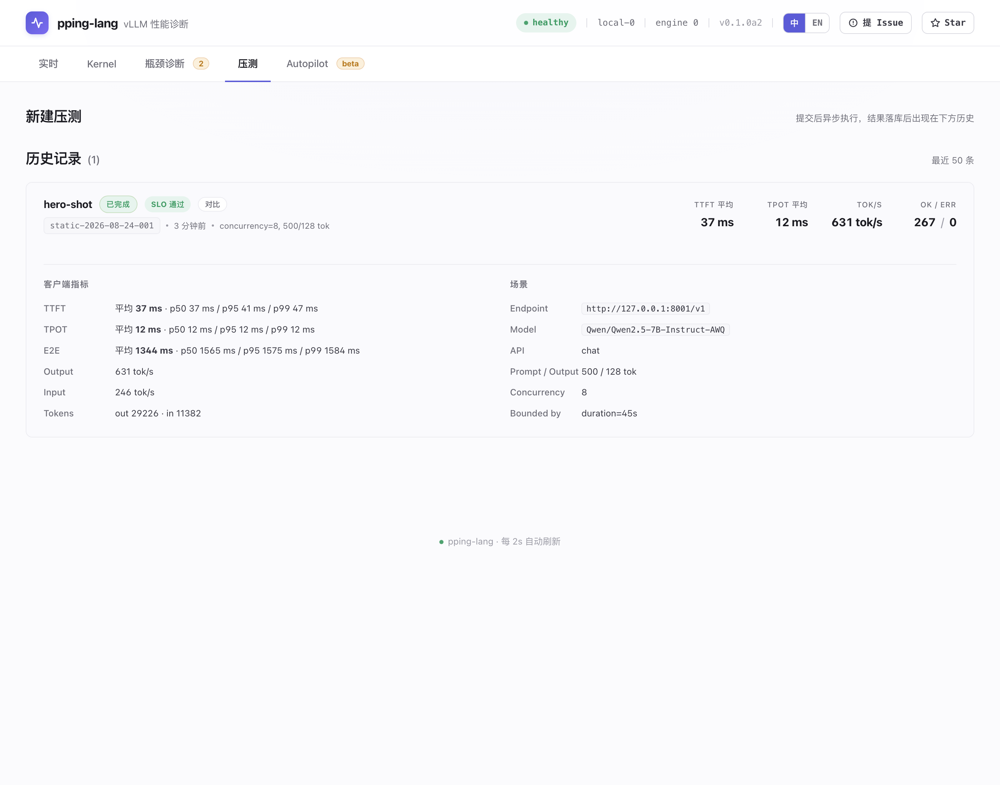
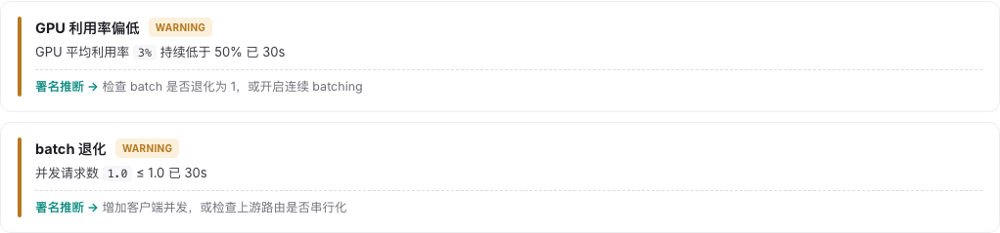
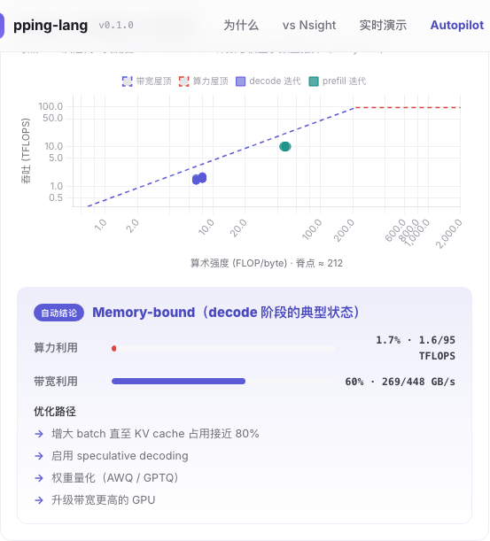

> **简体中文** | [English](README.en.md)

<div align="center">

# pping-lang

**vLLM 性能诊断插件 —— 常驻 Kernel 级观测、实时指标显示、沙盒自动调参**

[](https://pypi.org/project/pping-lang/)
[](https://pypi.org/project/pping-lang/)
[](LICENSE)
[](#项目状态)
[](tests/)
[](https://leon-hf.github.io/pping-lang/)

**[🌐 在线演示 Live Demo →](https://leon-hf.github.io/pping-lang/)** —— 浏览器直接看真机采到的仪表盘（实时 / Kernel / 规则 / 压测 / Autopilot，中英双语）

[](https://leon-hf.github.io/pping-lang/)

> 🔬 **核心能力是 Kernel 级观测**：把通常要开 Nsight Compute 才拿得到的深度 —— 每 kernel 时间占比、warp stall 归因、Python 源码行 / SASS 热点、launch 配置、per-kernel roofline —— 做成**常驻、低开销、不停服务**，并自带结论。详见 [Kernel 观测](#kernel-观测)。

> 🤖 **Autopilot 已跑通真机闭环**：沙盒里按「诊断 → 只改一个参数 → 压测 → 留下/回滚」迭代，`max_num_seqs` 逐级 4 → 64，吞吐 **986 → 6,094 tok/s（×6.18）**；破 SLA 就回滚，不编造收益。详见 [Autopilot](#autopilot)。

[在线演示](https://leon-hf.github.io/pping-lang/) · [快速上手](#快速上手) · [Kernel 观测](#kernel-观测) · [Autopilot](#autopilot) · [仪表盘](#仪表盘) · [兼容性](#兼容性) · [架构](#架构) · [路线图](#路线图)

</div>

---

## 概述

vLLM 服务慢的时候，真正想知道的是：哪个 kernel 慢、为什么慢、该改哪里。监控曲线回答不了 —— GPU 利用率 85% 看着一切健康，其实 decode 阶段瓶颈常在显存带宽（利用率稳定在 70–90% 而真实算力利用率可能不足 5%，GPU 在等数据，不是在算）。要拿到真答案就得下到 kernel 级 —— 而这通常意味着 Nsight Compute 或 torch profiler。它们的问题：

1. **用起来要先停一下**。得专门开一个采集会话：ncu 要把服务跑在 profiler 下面（甚至重放 kernel 多遍来采齐指标），torch profiler 开窗期间开销显著 —— 正常服务被打断，采到的也只是那一小段窗口
2. **给的是原始证据，不是结论**。SASS 指令、stall reason、occupancy 摆在面前，从数据到「该调哪个参数、该改哪个 kernel」需要微架构专家来读；而且它们只看 GPU，不认识 vLLM 的概念（TTFT / TPOT / KV cache / `max_num_seqs`），两个世界要自己对齐

pping-lang 把 Nsight 级的深度做成 vLLM 的常驻听诊器：`pip install` 后照常 `vllm serve` 就有模型级诊断（示例见下），换成 `pping-vllm serve` 再加常驻的 kernel 级证据 —— 全程不停服务、自带结论。

诊断结论（规则名 = 测出来的事实，处方作为署名推断单列）：

[](https://leon-hf.github.io/pping-lang/)

Roofline 视图附带自动结论与优化路径：

[](https://leon-hf.github.io/pping-lang/)

以上是模型级结论。更深的证据在 Kernel 级 —— 这是 pping-lang 最硬的部分。

---

## Kernel 观测

> Nsight 是实验室显微镜 —— 偶尔抓一段、离线看、给原始证据；pping-lang 是常驻听诊器 —— 一直跑、说人话、告诉你该调哪里。

把通常要开 Nsight Compute 才拿得到的 kernel 级深度，做成**常驻、低开销、不停服务**，并自带结论。`pping-vllm` 完整接入后默认开启，在**默认多进程 `vllm serve`** 上即可工作（PC Sampling 在 EngineCore 进程内驱动，结果跨进程回流 dashboard），eager 与 cudagraph（生产默认）均支持：

| 能力 | 你看到的 | 口径 |
|:--|:--|:--|
| 每 kernel 时间占比 + 算子分类 | GEMM / Attention / elementwise / comm 各占多少 GPU 时间，热点是谁 | PC Sampling 常驻（固定周期采样，样本数 ∝ GPU 时间） |
| Deep Evidence「为什么慢」 | warp 周期三态（发射 / 停滞 / 调度空转）、全局 stall 分解，可下钻到 PerfWorks 原始 reason | 同上 |
| 源码级热点（双轨） | Triton kernel 定位到 Python 源码行 + 该行代码原文；闭源库给 SASS 指令热点 + kernel 名解码（`cutlass wmma_bf16 16x16` → tile / 精度 / 目标架构） | 源码行需 lineinfo（Triton / 自编译），闭源走 SASS 轨 |
| 启动来源 | 闭源 GEMM 也归因到调用它的 host 代码链（如 `nn.Linear`） | DRIVER_API launch 回调，首次出现时抓 backtrace |
| Launch 配置 | 每个 kernel 的 grid / block / 寄存器 / shared memory | launch-hook 常驻，实测与 PCS 共存，增量开销纳秒级 |
| Deep Profile | 理论 occupancy + 受限资源徽标（寄存器 / smem / grid）+ wave 量化 + 修改建议（`__launch_bounds__` / 缩 tile / grid 对齐 SM 数） | 纯计算（由 launch 配置 + 设备属性推出），pause_ms=0 不停服务 |
| Per-kernel roofline | 按家族（marlin / cutlass / gemv / flash）的算术强度、achieved 带宽与判型：compute-bound / memory-bound / **memory-latency-bound（该加并发，不是改 kernel）** | 软件估算，不占计数器；AI / 判型高置信，achieved 低置信并标注 |
| L2 / DRAM 实测 | 每家族的 L2 命中率与 DRAM GB/s（† 徽标） | ncu 离线标定（每 model × GPU 一次，约 20 分钟维护窗）→ 在线查表 |
| 快照 A/B 对比 | 「改动前 / 改动后」逐 kernel 对比 stall 构成与速率；带负载漂移检测 —— 负载变了会警告，不冤枉你的改动 | 前端 localStorage |
| 通信细分 | allreduce / all_gather / reduce_scatter 各自占比（多卡场景；单卡自动隐藏） | 同 PCS |

**为什么能做到不停服务**：单卡上所有硬件计数器路径两两互斥 —— 这是实测结论，不是推断：PCS 活跃时开启 Activity 记录返回 `CUPTI_ERROR_NOT_COMPATIBLE`，侧车进程查询 PM Sampling 计数器直接 `HARDWARE_BUSY`。因此 Kernel 观测拆成三路：**常驻 PC Sampling**（诊断证据）+ **launch-hook**（实测可与 PCS 共存，拿 launch 配置）+ **软件估算 / 离线标定查表**（roofline 与 L2 / DRAM，不占计数器）。需要"真值"的深窗采集（停 PCS → Profiling API → 重启）留作独立决策，默认不做。

**诚实边界**：PCS 数字是统计估算而非精确微秒；理论 occupancy 与 achieved 带宽是估算值，UI 逐项标注估算 / 实测（†）与置信度；CUDA graph 稳态下 launch 配置是捕获时值。要求 Linux + 性能计数器解锁 + 本机可编译 `.so`（缺 g++ / CUPTI 头文件则自动降级为基础接入，任何失败都不影响 vLLM 本身）。

---

## 快速上手

### 离线 demo（无需 GPU / vLLM）

```bash
pip install pping-lang
python -m examples.embedded.demo
```

脚本注入合成指标，约 7 秒后终端打印诊断，dashboard 可访问 `http://localhost:8765`。

### 接入 vLLM

**基础接入** —— KPI / Roofline / NVML / 诊断,自动加载,不改任何参数：

```bash
pip install pping-lang
vllm serve <model>
```

vLLM 启动日志将输出 dashboard 地址 `[pping-lang] dashboard → http://localhost:8765`。

**完整接入** —— 再加 Kernel 级 PC Sampling（Deep Evidence「为什么慢」）：

```bash
pip install pping-lang
pping-vllm serve <model>      # 等价于 vllm serve,额外开启 Kernel 级采集
```

`pping-vllm` 是一层薄包装：首次自动把内置的 CUPTI 注入库（`libppingcupti.so`）在本机**现编**
（自动探测 cu12/cu13，缓存到 `~/.pping-lang/`），设好注入与采样环境变量，再 `exec vllm serve`
（透传所有参数）。编不出 `.so`（无 g++ / 无 CUPTI）则**自动降级**为基础接入。

> Kernel 级采集通过 `vllm.general_plugins` 入口在 **EngineCore 进程**驱动 PC sampling、结果跨
> 进程回流前端 dashboard —— 在**默认多进程 `vllm serve`** 上即可工作,无需单进程。

---

## Autopilot

不止诊断，还在沙盒里自动调：按「诊断 → 只改一个参数 → 压测 → 留下/回滚」迭代，**生产 promote 永远人工确认**。真机（runw，RTX 5060 Ti、vLLM 0.21、Qwen2.5-0.5B）上验证过的三种收敛形态：

- **真机 ×6.18**：Agent 依据「准入闸过低」诊断把 `max_num_seqs` 逐级 4 → 64，每轮 bench 验证后才保留，吞吐 986 → 6,094 tok/s（×6.18），最终给出人工 promote 的 `vllm serve` 推荐命令
- **敢回滚**：另一次 session（2026-07-07）一步把 `max_num_seqs` 4 → 32 拿到 ×5.1，但实测 TPOT p99 82 ms 破 50 ms SLA —— 判负回滚，收敛到该 SLA 下的诚实最优。提议可以大胆，判决只认数据
- **会认账**：7B-AWQ 上诊断命中带宽墙后，Agent 论证「无对症参数」诚实收敛，不编造收益

快速上手见 [Autopilot 真机调优 Quickstart](docs/autopilot-quickstart.md)。

---

## 仪表盘

单页应用，单文件 HTML，无需前端构建工具。四个标签页：

| 标签页 | 内容 |
|:--|:--|
| 实时 | 12 项 KPI（TTFT / TPOT / 吞吐 / KV cache / 队列状态 / MFU / GPU 利用 / 显存 / Prefix cache / Padding / 抢占率）；Roofline 散点 + 自动结论；TTFT / TPOT / E2E 时序图。每项 KPI 支持 hover 查看公式与解读 |
| Kernel | Nsight 级深度、常驻采集、不停服务 —— 时间占比 / stall 归因 / 源码级热点 / launch 配置 / Deep Profile / 快照对比，详见 [Kernel 观测](#kernel-观测)。需 `pping-vllm` 完整接入，eager 与 cudagraph（生产默认）均支持 |
| 规则 | 只读展示生效中的事实规则（事实名 / 严重度 / 判定条件 + 配置解析后的阈值 / 前置与 regime 门）；中心化 SLA + 阈值编辑器，保存即热加载进运行中的引擎，不重启 vLLM；可增删自定义规则，与策展规则同一引擎评估 |
| 压测 | 内置 OpenAI 协议静态压测器，配置 endpoint / 调用名 / 并发 / 时长 / prompt 来源，输出 client-side TTFT / TPOT / E2E 分布及 SLO 校验 |

实时数据从 Sink 的内存 ring buffer 直读，延迟约等于轮询间隔。

---

## 兼容性

### vLLM 版本

| vLLM | 状态 | SchedulerStats | IterationStats | cudagraph_stats | perf_stats |
|:--|:--|:--:|:--:|:--:|:--:|
| 0.20+ | 推荐 | ✓ | ✓ | ✓ | ✓ |
| 0.13.x | 支持 | ✓ | ✓ | ✓（字段不同） | ✗ |
| < 0.13 | 不支持 | — | — | — | — |

`perf_stats` 是 MFU、显存带宽利用率与实测 Roofline 的数据源，仅 0.20+ 提供。在 0.13.x 上：

- MFU、padding ratio KPI 显示为空（不进行不可靠的构造）
- Roofline 自动切换至 analytical 模式，绝对值存在约 ±20% 误差；卡片标识数据来源
- 其余功能不受影响：TTFT / TPOT / E2E 完整分布、KV cache、prefix cache 命中、preemption、NVML 全套采样、规则诊断

### 运行环境

- Linux：原生支持
- Windows：需通过 WSL2 + Ubuntu。跨子系统访问 dashboard 时需设置 `PPING_LANG_API_HOST=0.0.0.0`

### 已识别 GPU 列表

NVML 设备名 → BF16 peak (TFLOPs/s) 与显存带宽 (GB/s)。未识别的 GPU 不影响指标采集，仅跳过依赖峰值的派生量。

```
Blackwell        B200 (2250 / 8000) · B100 (1800 / 8000)
Hopper           H200 (989 / 4800) · H100 SXM/PCIe/NVL · A100 SXM/PCIe
Ada 数据中心      L40S · L40 · L4
Ada 桌面 / 移动   RTX 4090 / 4080 / 4070 Ti / 4070 / 4060 Ti / 4060 (含 Laptop GPU)
旧代             A30 · A10G · A10 · V100 · T4 · RTX 3090
```

补充设备：在 [`src/pping_lang/hardware.py`](src/pping_lang/hardware.py) 的 `_GPU_PEAK_TABLE` 添加条目。

---

## 性能

### 热路径开销

| 项目 | 实测 |
|:--|:--|
| `push_metric()` 单次 | <5 μs |
| `record()` 单次（含 collector 解析） | ≈100 μs |
| Sink bg flush 线程 CPU | <1% |
| 常驻内存 | ≈6 MB |

### 基准：Qwen2.5-0.5B-Instruct / RTX 4070 Laptop / WSL2 / vLLM 0.13.0

bench concurrency=3，时长 20s：

| 指标 | 值 | 数据来源 |
|:--|:--|:--|
| TTFT p99 | 305 ms | client-side |
| TPOT p99 | 22 ms | client-side |
| Output throughput | 28 tok/s | `vllm.iter.gen_tokens` |
| 单请求 decode 速度 | 138 tok/s | 1000 / TPOT p50 |
| 算力利用 | 1.2% | analytical Roofline |
| 带宽利用 | 51.5% (132 / 256 GB/s) | analytical Roofline |
| Bound 判定 | memory-bound | 中位 AI = 3.0 < knee 130 |

### 实时延迟

实时面板数据自 Sink 内存层直读，不经持久化层（JSONL）。指标自 `record()` 产生至 dashboard 渲染的端到端延迟约等于 HTTP 轮询周期（默认 2s）。

---

## 架构

```
                ┌─── live 内存层（O(1) 写 / O(1) 读）
                │       ↑                ↑
record() ──push─┤   /api/kpis        /api/metrics/recent  ≤60s
NVML 100ms ─────┤   /api/snapshot    /api/roofline        ≤60s
                │   /api/latency_trends                   ≤900s
                │
                │   Sink._latest:  name → (value, ts_ns)
                │   Sink._recent:  name → 2000-deep ring
                │
                └─── bg flush ─── JSONL append-log ─── archival 扫描
                                   metrics / diagnoses    (长时间窗，JsonlStore)
```

热路径仅执行 O(1) 入队，不进行 I/O、序列化或锁等待。持久化是顺序追加 JSONL（无查询引擎 / 事务 / 索引，写入近乎零争用）；长时间窗历史按需扫文件，属冷路径。诊断引擎与 Sink flush 在独立 daemon 线程运行。设计前提：插件任何异常不得影响 vLLM 推理路径。

### 关键源文件

- [`src/pping_lang/sink/base.py`](src/pping_lang/sink/base.py) —— 双路径 Sink 抽象与 ring buffer 定义
- [`src/pping_lang/sink/local.py`](src/pping_lang/sink/local.py) —— JSONL 顺序追加持久化（AppendLog 写端 / JsonlStore 读端，定义见 [`sink/metric_log.py`](src/pping_lang/sink/metric_log.py)）
- [`src/pping_lang/collector/vllm_stats.py`](src/pping_lang/collector/vllm_stats.py) —— vLLM IterationStats → MetricPoint 适配
- [`src/pping_lang/rules/diagnosis_runtime.py`](src/pping_lang/rules/diagnosis_runtime.py) —— 事实规则诊断引擎（评估循环，默认 1s）；纯求值核见 [`diagnosis_engine.py`](src/pping_lang/rules/diagnosis_engine.py)，规则定义见 [`diagnosis_rules.py`](src/pping_lang/rules/diagnosis_rules.py)，中心配置见 [`diagnosis_config.py`](src/pping_lang/rules/diagnosis_config.py)
- [`src/pping_lang/api/routes.py`](src/pping_lang/api/routes.py) —— FastAPI endpoints
- [`src/pping_lang/ui/index.html`](src/pping_lang/ui/index.html) —— Alpine.js + Chart.js dashboard

---

## 配置

| 环境变量 | 默认值 | 说明 |
|:--|:--|:--|
| `PPING_LANG_API_PORT` | `8765` | dashboard 监听端口 |
| `PPING_LANG_API_HOST` | `127.0.0.1` | 监听地址（容器 / WSL 场景设为 `0.0.0.0`） |
| `PPING_LANG_DB_PATH` | `~/.pping-lang/local.duckdb` | 取其父目录作 JSONL 持久化目录（`metrics.jsonl` / `diagnoses.jsonl`）；bench 结果仍存此 DuckDB 文件 |
| `PPING_LANG_RETENTION_SECONDS` | `7200` | 指标持久化保留时间窗口（时间为主，切卷滚动；洪流下按卷大小兜底、磁盘有界） |
| `PPING_LANG_INSTANCE_ID` | 主机名 | 多实例聚合时的标识 |
| `PPING_LANG_FLUSH_INTERVAL_S` | `5.0` | Sink → JSONL 追加周期 |
| `PPING_LANG_SINK_QUEUE_SIZE` | `65536` | Sink 内存队列容量 |
| `PPING_LANG_RULE_EVAL_INTERVAL_S` | `1.0` | 诊断引擎评估周期 |
| `PPING_LANG_RULES_PATH` | — | 规则覆盖 JSON 路径（RuleStore） |
| `PPING_LANG_CUSTOM_RULES_PATH` | `<DB_PATH 父目录>/custom_rules.json` | 自定义规则 JSON 持久化路径（与策展规则同一引擎评估） |
| `PPING_LANG_DISABLE_NVML` | — | 设为 `1` 关闭 NVML 采样 |
| `PPING_LANG_DISABLE_RULES` | — | 设为 `1` 关闭规则引擎 |
| `PPING_LANG_DISABLE_API` | — | 设为 `1` 关闭 HTTP API 与 dashboard |
| `OTEL_EXPORTER_OTLP_ENDPOINT` | — | 配置后将指标同时导出至 OTel 后端 |

---

## 路线图

| 版本 | 部署模式 | 重点 |
|:--|:--|:--|
| v0.1（当前）| Embedded | 单机本地，pip 安装即用，dashboard + 规则引擎 + bench |
| v0.2 | Sidecar / Centralized | 独立 server 进程、Docker 镜像、Helm chart、K8s 多副本指标聚合 |
| v0.3 | Stateless | OTel-native，基于已有 Prometheus / Tempo 后端的诊断 |

---

## 项目状态

`v0.1.0`（首个正式版）。当前为 Embedded 模式，目标场景为单机本地开发与单卡 / 单 Pod 部署。生产侧的 Sidecar 模式、K8s 多副本聚合在 v0.2 规划。

API 在 0.x 阶段允许不兼容变更；规则 JSON schema 与 dashboard URL 路径承诺向后兼容。

---

## 开发

```bash
git clone https://github.com/leon-hf/pping-lang.git
cd pping-lang
pip install -e ".[dev,bench]"
bash scripts/setup-hooks.sh
pytest
ruff check src/ tests/
```

贡献流程见 [CONTRIBUTING.md](CONTRIBUTING.md)，版本变更记录见 [CHANGELOG.md](CHANGELOG.md)。

---

## Acknowledgments

- [vLLM](https://github.com/vllm-project/vllm) —— `stat_logger_plugins` 入口
- [DuckDB](https://duckdb.org/) —— bench 结果的嵌入式存储
- [NVIDIA NVML](https://docs.nvidia.com/deploy/nvml-api/) —— GPU 物理层采样
- 性能模型参考：Williams et al., *Roofline: An Insightful Visual Performance Model* (CACM 2009)；Kaplan et al., *Scaling Laws for Neural Language Models* (2020)

---

## Citation

```bibtex
@software{pping_lang,
  title  = {pping-lang: A diagnostic plugin for vLLM},
  author = {Leon},
  year   = {2026},
  url    = {https://github.com/leon-hf/pping-lang},
}
```

## License

This project is licensed under the **Apache License, Version 2.0**. See the [LICENSE](LICENSE) file for the full text.

Copyright © 2026 Leon
